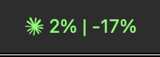

# CodexBar 🎚️ - May your tokens never run out. (LARKIN FORK)

Per steipete:
> Tiny macOS 14+ menu bar app that keeps your Codex, Claude, Cursor, Gemini, Antigravity, Droid (Factory), Copilot, z.ai, Kiro, Vertex AI, Augment, Amp, and JetBrains AI limits visible (session + weekly where available) and shows when each window resets. One status item per provider (or Merge Icons mode); enable what you use from Settings. No Dock icon, minimal UI, dynamic bar icons in the menu bar.

> ![IMPORTANT]
> This is a FORKED project. I'll tell you why I did that below. 
>
> That being said, you should check out https://github.com/steipete/CodexBar for the original project...
>
> But you should still probably star both.

# Differences from the Original CodexBar

## Auth Changes

This is actually inspiration from a pretty slept on project: https://github.com/richhickson/claudecodeusage

I really like this project because it's dead simple. There are also probably ~50 different Github repos doing the same thing where it's a MacOS Menu Bar to track <insert generic AI lab's CLI tool>'s usage. That's all great. That's the world we're living in when software is that cheap.

steipete's is probably the most popular because of the wide range of tooling support. I fucking hate it because the auth model is an absolute joke. Does it need to DDOS your computer with notifications saying it basically needs FDA, macOS security permissions, AND keychain access? It scrapes browser cookies, etc, etc. 

That's fine, but the beauty of claudecodeusage is... it just works based on your existing auth tokens from running either `claude` or `codex` in your preferred shell.

## Projected Usage

I like the notion of pace, but I think it's even more helpful to see the week over week pace. I also want to see it visually , so that's why there is a `Weekly Projection` option. 

## 5 hour Window Pace

I like the notion of pace, but I think it should also render for the 5 hour windows for Codex and Claude.

## Coloring of the Icons

I want to look at my menu bar and immediately know my CC usage or my Codex usage. @richhickson's project does that better by showing 🟢🟡🔴 so I wanted to do something similar with my version of CodexBar, but instead I wanted to color the claude / codex menu bar options. 

Ya see how it's colored. 

## Bar vs Dot dividing Usage vs Pace 

See this: 

and this new option:

