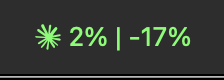
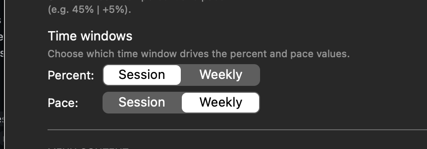
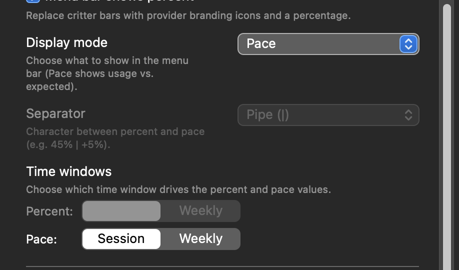

# CodexBar 🎚️ - May your tokens never run out. (LARKIN FORK)

Tiny macOS 14+ menu bar app that keeps your Codex, Claude, Cursor, Gemini, Antigravity, Droid (Factory), Copilot, z.ai, Kiro, Vertex AI, Augment, Amp, JetBrains AI, and OpenRouter limits visible (session + weekly where available) and shows when each window resets. One status item per provider (or Merge Icons mode with a provider switcher and optional Overview tab); enable what you use from Settings. No Dock icon, minimal UI, dynamic bar icons in the menu bar.

> ![IMPORTANT]
> This is a FORKED project. I'll tell you why I did that below. 
>
> That being said, you should check out https://github.com/steipete/CodexBar for the original project...
>
> But you should still probably star both.

# Differences from the Original CodexBar

## Auth Changes

This is actually inspiration from a pretty slept on project: https://github.com/richhickson/claudecodeusage

I really like this project because it's dead simple. There are also probably ~50 different Github repos doing the same thing where it's a MacOS Menu Bar to track <insert generic AI lab's CLI tool>'s usage. That's all great. That's the world we're living in when software is that cheap.

steipete's is probably the most popular because of the wide range of tooling support. I fucking hate it because the auth model is an absolute joke. Does it need to DDOS your computer with notifications saying it basically needs FDA, macOS security permissions, AND keychain access? It scrapes browser cookies, etc, etc. 

That's fine, but the beauty of claudecodeusage is... it just works based on your existing auth tokens from running either `claude` or `codex` in your preferred shell.

> **Status as of the 0.46 sync:** this is a gripe, not a code difference. This fork carries **no** auth-model changes — it never has, in the tree. An earlier attempt to default Claude keychain reads to the `/usr/bin/security` CLI was proposed upstream ([#353](https://github.com/steipete/CodexBar/pull/353), [#532](https://github.com/steipete/CodexBar/pull/532)) and not taken; upstream now actively coerces that strategy back to the Security framework. Upstream's supported way to avoid the prompts is **Settings → Claude → keychain prompt mode = Never**, which this fork uses rather than carrying a patch against code upstream is deliberately retiring.

- [Codex](docs/codex.md) — Local Codex CLI RPC (+ PTY fallback) and optional OpenAI web dashboard extras.
- [Claude](docs/claude.md) — OAuth API or browser cookies (+ CLI PTY fallback); session + weekly usage.
- [Cursor](docs/cursor.md) — Browser session cookies for plan + usage + billing resets.
- [Gemini](docs/gemini.md) — OAuth-backed quota API using Gemini CLI credentials (no browser cookies).
- [Antigravity](docs/antigravity.md) — Local language server probe (experimental); no external auth.
- [Droid](docs/factory.md) — Browser cookies + WorkOS token flows for Factory usage + billing.
- [Copilot](docs/copilot.md) — GitHub device flow + Copilot internal usage API.
- [z.ai](docs/zai.md) — API token (Keychain) for quota + MCP windows.
- [Kimi](docs/kimi.md) — Auth token (JWT from `kimi-auth` cookie) for weekly quota + 5‑hour rate limit.
- [Kiro](docs/kiro.md) — CLI-based usage via `kiro-cli /usage` command; monthly credits + bonus credits.
- [Vertex AI](docs/vertexai.md) — Google Cloud gcloud OAuth with token cost tracking from local Claude logs.
- [Augment](docs/augment.md) — Browser cookie-based authentication with automatic session keepalive; credits tracking and usage monitoring.
- [Amp](docs/amp.md) — Browser cookie-based authentication with Amp Free usage tracking.
- [JetBrains AI](docs/jetbrains.md) — Local XML-based quota from JetBrains IDE configuration; monthly credits tracking.
- [OpenRouter](docs/openrouter.md) — API token for credit-based usage tracking across multiple AI providers.
- Open to new providers: [provider authoring guide](docs/provider.md).

## Features
- Multi-provider menu bar with per-provider toggles (Settings → Providers).
- Session + weekly meters with reset countdowns.
- Optional Codex web dashboard enrichments (code review remaining, usage breakdown, credits history).
- Local cost-usage scan for Codex + Claude (last 30 days).
- Provider status polling with incident badges in the menu and icon overlay.
- Merge Icons mode to combine providers into one status item + switcher, with an optional Overview tab for up to three providers.
- Refresh cadence presets (manual, 1m, 2m, 5m, 15m).
- Bundled CLI (`codexbar`) for scripts and CI (including `codexbar cost --provider codex|claude` for local cost usage); Linux CLI builds available.
- WidgetKit widget mirrors the menu card snapshot.
- Privacy-first: on-device parsing by default; browser cookies are opt-in and reused (no passwords stored).

## 5 Hour Window Pace

Pace indicators for the Codex and Claude 5-hour windows. Contributed upstream and merged in [#355](https://github.com/steipete/CodexBar/pull/355), so this is no longer a fork difference — it ships in upstream CodexBar too.

## Coloring of the Icons

I want to look at my menu bar and immediately know my CC usage or my Codex usage. @richhickson's project does that better by showing 🟢🟡🔴 so I wanted to do something similar with my version of CodexBar, but instead I wanted to color the claude / codex menu bar options. 

Ya see how it's colored. 

## Menu Bar Layout

The fork's old separator-style toggle was retired when this synced to upstream 0.46. Upstream's menu bar layout editor covers it and more — you can place, reorder, and remove separator, percent, pace, reset, and cost tokens per provider.

## Better Menu Bar Configurations

More flexibility for your menu bar again:

### Menu Bar Options (Part 1)

### Menu Bar Options (Part 2)

